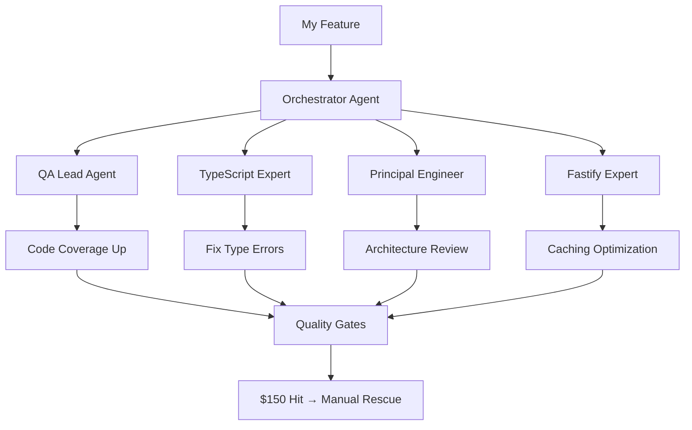
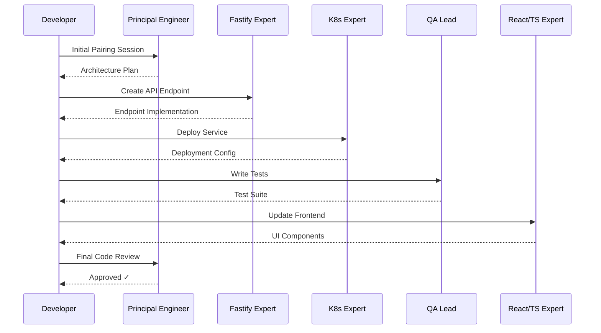

import { TokenCostChart, AgentTaskCostChart, ProjectCostComparisonChart, TokenCostCalculator } from "../components/ai-cost-charts";

As a software engineer in 2026, I use AI all the time.
My most active Github repository may be Claude config repo.
Most days now, I'm there adding rules, telling Claude to make one comment,
[_louder_](https://www.anthropic.com/engineering/claude-code-best-practices#a-create-claudemd-files),
updating hooks, rules, and agents to handle more usecases.
Managing how I try to make Claude code write code like me.
Or, even better, write code better than me is something I feel it's worthwhile to spend time on.

While Anthropic has been willing to lose ~$1k USD a month on my Claude Max plan,
I have been willing to lose $200 USD on my Claude Max plan. The relationship has been decent.
I've deployed basic apis that would have taken me a few weeks to write in a few hours.
And. I've embarrassed myself by submitting pull requests where I've proved that true _does_ equal true 1000 times.
This _is_ new developer tools. Amiright?

<figure>
    
  <figcaption>This cost was my Claude Usage actual cost in October 2025</figcaption>
</figure>

---

## Just A Caveman In A Cave

However, despite this handshake that I've had with these smart, naive, decepticons, there has been a problem looming.
Well, one problem for the subject of this post.
The problem of tokens, or, what matters to me,
the [cost-per-token](https://artificialanalysis.ai/models/comparisons/deepseek-v3-1-reasoning-vs-claude-4-opus)—which,
I had been told, could be a lot.
This cost had felt abstract to me since we, engineers (for this post's context), all started using chat a few years ago.
I'd heard about effects on the environment and powergrind. However, it's a weird abstraction.
I'm at home typing on my computer as I have always done. It's weird to think that now it affects the planet.

Until 48 hours ago, I'd looked at my usage and thought,
_This is a crazy cost per acquisition_. In prep, I had done minor shifts to manage my AI infrastructure.
But, I'd also read DHH's post ["Local LLMs are how nerds now justify a big computer they don't need"](https://world.hey.com/dhh/local-llms-are-how-nerds-now-justify-a-big-computer-they-don-t-need-af2fcb7b) and,
well, fair—_why put the effort in when my Max plan will be better?_ DHH is smart and so are the people that are building these models so back to Claude.

---

## Approximate Cost Per Query

What I pay approximately per query - your approximate baseline before adding agents.
This is not a session but one question in a session.

<TokenCostChart />

---

Then, 48 hours ago, I started to get a message in bright yellow at the bottom of my Claude code prompts.
"Your usage is about to run out". It was concerning because I had a major project with a deadline looming for the next day.

> You may see where this is going. And, you may be thinking to yourself already, "If this guy can code, then, "What's the problem?".
> Well, **the problem is**, I have been building this project's features like a foreman.

For this project, I spent time writing my architectural plan, crafting agents to work together to assist in completing major pieces of the project.
My intended role was that of a foreman where I expected to take pieces of the project but major chunks work went to different agents.

---

Since Claude code came out, honing ways to instruct Claude to write code with the essence of me or how most benefits my work has been my objective.
And for the last month, I have been honing an orchestrator agent flow where I've prompted a few super hero agents and they largely execute on tasks and I am a man in the middle overseeing the work.
It is cool! I mean, it IS cool if I can afford it.

---

## Flowchart of the architectural agentic pattern I was following

My expensive orchestration pattern - the exact flow that hit $150/hour.
Your agents might differ, but watch for similar token multiplication.

---

As the messaging got more persistent about my usage, I observed I kept getting shifted to different models—or it felt like it.
I had my QA Lead agent working with my typescript expert agent getting code cov up.
I had my principal engineer working with my fastify expert ensuring caching was optimal.
But the quality was starting to degrade. I felt like I was going to have to jump ship.
So close to the deadline, anxiety was setting in.

---

## Cost Per Query Based On Agent Token

My orchestrated agent costs - how specialized instructions multiply token usage.

<AgentTaskCostChart />

---

## 90% Done and No Tokens

Then two pretty difficult things happened at once.

1. The degraded reactive typescript expert edited code to fix `any` type errors which caused tests to fail, and
2. Claude told me my usage was fully used up.
I had to pay more.

I wasn't too worried. Initially. 
Maybe a little type casting and slightly lower test coverage than I had hoped. But, a benefit of AI engineering is providing proof of what was done is easier.
However, along side providing proof easier, it is also far more important!
I find I need to provide proof to myself, then my team—especially when a large portion of the code was fully written by an agent.

Anways, it turned out my situation was worse than I had thought.
While my typescript reactive expert was fixing the hundreds of `any` types, the fastify expert had done something for caching AND,
well, the whole thing stopped working in a matter of minutes.
The gist of the issue was small—a few key type hints were extremely off leading to a new endpoint missing a header value and thus, failing.
Although, small. It was a tough problem. It was fun to ramp up on a large product with way less context than what I would have had pre-2022 but it was not where I wanted to be pre-product review.
Stressed out, I paid $150 and put in a few hours of deep work to get things back on track; missing a product review I'd hoped to have.
This may read like low friction, but this was just me—no team, just me handling all of that deadline stress.

I'm sure you can empathize or, perhaps, know what I could have done better. Please share.

---

## Representation of normal LLM coding vs Agent coding

My $150 wake-up call: single prompts vs my orchestrated agent team.
Your pattern might differ, but parallel agents compound costs fast.

<ProjectCostComparisonChart />

---

## Revelations

Moving forward. I will continue to use Claude. It's the best for me, currently.
I will review how I can incorporate agents from open source models, routing, and tools like crush so I can be less reliant on Claude.
And although I have looked into tools that save tokens, I need to improve my workflow now.
Dropping $150 to wrap up a project because I am a one person team is not how I would hope this would work.
Especially when incurring the most difficult 10% of the project and the stress.
I will also now try to execute more closely to how I would have built the product alone.

<TokenCostCalculator />

Calculate your own potential burn rate - my $150 hour started with these same 'reasonable' numbers.

---

## Conclusion

It was really fun to fully code again. I didn't feel obsolete. I felt like a builder.
It was stressful to have a 95% done API and a 95% done new app flow but the train got chugging.
If coding _is_ becoming an art, then I am happy to call my keyboard a paint brush!
And, I do appreciate the new craft. I do hope as a human I get to participate in the fun parts of this tooling.
Currently, for this project, I felt like I was replacing a team, including all of the stress of a team's deadline, leaving the fun UI and API mocks to the Claude.
It's confusing; definitely more to learn.

## Efficient Iterative Development Pattern

After my $150 wake-up call, I switched to a more focused iterative approach.
Instead of running multiple agents in parallel, I pair with a Principal Engineer upfront and then work with one expert at a time, sequentially.

The sequential pattern provides more control and deeper understanding for me and on the Claude Max plan I can work ~12-18 hours per day without cost concerns. I think I execute faster to "done-done" with this approach but with more cognitive load—less plan and chill; more pairing.

---

**An article written by [Nicholas C. Zakas](https://humanwhocodes.com/blog/), code god creator of [eslint](https://eslint.org/) and inspirational person on multiple levels wrote [this post](https://newsletter.humanwhocodes.com/posts/expensive-ai-is-coming) which clear illustrates the issue.
I'm also continually following [crush](https://github.com/charmbracelet/crush), [ollama](https://ollama.com/), and [opencode](https://opencode.ai/) to try and insure I have some idea of what's going on!
I used claude writing this. I wrote most of the article by hand and used Claude Code to ensure a decent parallel between my experience and yours could be drawn. I also used Claude to gather data so my problem can be clearer to you.**

