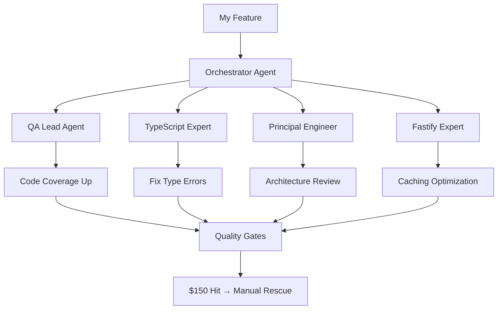
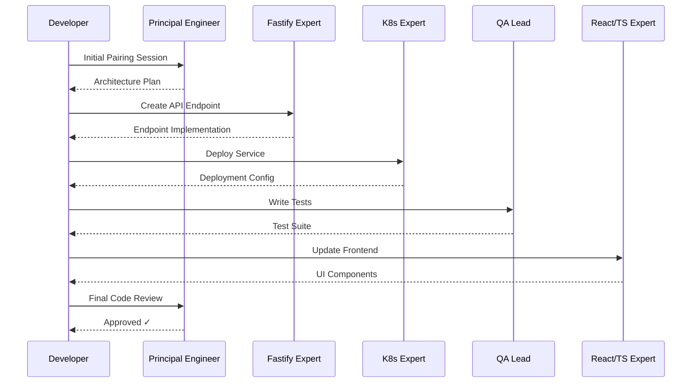

import {
  AgentTaskCostChart,
  ProjectCostComparisonChart,
  TokenCostChart,
  TokenCostCalculator,
} from "../lib/components/content/expensive-ai";

As a software engineer in 2026, I use AI all the time.
My most active GitHub repository may be my Claude config repo.
Most days, I'm there adding rules, telling Claude to make one comment
[_louder_](https://www.anthropic.com/engineering/claude-code-best-practices#a-create-claudemd-files),
or updating hooks and agents to handle another use case.
I think it's worth spending time teaching Claude Code to write code like me, or better than me.

While Anthropic has been willing to lose ~$1k USD a month on my Claude Max plan,
I have been willing to lose $200 USD on my Claude Max plan. The relationship has been decent.
I've deployed basic APIs in a few hours that would have taken me a few weeks to write.
I've also embarrassed myself with pull requests proving that true _does_ equal true 1000 times.
New developer tools. Amiright?

<figure>
  
  <figcaption>
    This cost was my Claude Usage actual cost in October 2025
  </figcaption>
</figure>

---

## Just A Caveman In A Cave

There was a problem with my handshake with these smart, naive decepticons: tokens.
Or, what matters to me, the [cost-per-token](https://artificialanalysis.ai/models/comparisons/deepseek-v3-1-reasoning-vs-claude-4-opus).
I'd been told the cost could be high, but it had felt abstract since we engineers started using chat a few years ago.
I'd heard about the effects on the environment and power grid too. Still, I'm at home typing on my computer as I always have.
It's weird to connect that familiar activity to the effects on the planet.

Until 48 hours ago, I'd looked at my usage and thought,
_This is a crazy cost per acquisition_. I'd made a few small changes to manage my AI infrastructure in preparation.
Then I'd read DHH's post ["Local LLMs are how nerds now justify a big computer they don't need"](https://world.hey.com/dhh/local-llms-are-how-nerds-now-justify-a-big-computer-they-don-t-need-af2fcb7b) and thought,
well, fair. _Why put in the effort when my Max plan will be better?_ DHH is smart, and so are the people building these models. Back to Claude.

---

## Approximate Cost Per Query

These are my approximate costs for one question in a session, before adding agents. A full session includes more than that one query.

<TokenCostChart />

---

Then, 48 hours ago, a bright yellow message started appearing at the bottom of my Claude Code prompts:
"Your usage is about to run out". I had a major project due the next day.

I'd been building the project's features like a foreman. I wrote the architectural plan and set up agents to handle major pieces of the work. I expected to take on pieces myself, but much of my role was overseeing what the agents produced.

Since Claude Code came out, I've been working on how to instruct it to write code that fits the way I work. For the last month, that meant refining an orchestrator flow with a few superhero agents doing much of the work and me in the middle reviewing it.
It's cool! I mean, it is cool if I can afford it.

## Flowchart of the architectural agentic pattern I was following

This is the flow I was using when I hit $150/hour. The agents you use may differ; the cost grows as each one uses more tokens.

```mermaid
flowchart TD
    A[My Feature] --> B[Orchestrator Agent]
    B --> C[QA Lead Agent]
    B --> D[TypeScript Expert]
    B --> E[Principal Engineer]
    B --> F[Fastify Expert]
    C --> G[Code Coverage Up]
    D --> H[Fix Type Errors]
    E --> I[Architecture Review]
    F --> J[Caching Optimization]
    G --> K[Quality Gates]
    H --> K
    I --> K
    J --> K
    K --> L[$150 Hit → Manual Rescue]
```

---

As the usage warnings became more persistent, it felt like I kept getting shifted to different models.
My QA Lead and TypeScript expert agents were working on code coverage, while my principal engineer and Fastify expert were working on caching.
The quality was getting worse. I was starting to think I'd have to jump ship, and with the deadline so close, I was getting anxious.

---

## Cost Per Query Based On Agent Token

These are the costs of my agent tasks, including the tokens used by their specialized instructions.

<AgentTaskCostChart />

---

## 90% Done and No Tokens

Two things happened at once:

1. The reactive TypeScript expert, whose work had been getting worse, tried to fix `any` type errors and broke tests.
2. Claude told me I'd used up my allowance and would have to pay more.

At first, I wasn't too worried. 
Maybe I'd need a little type casting and would end up with lower test coverage than I'd hoped.
AI makes it easier to produce evidence that code works, but I also find that evidence more necessary. I need to prove it to myself before I can prove it to my team, especially when an agent wrote a large part of the code.

It turned out to be worse than that. While the reactive TypeScript expert was fixing hundreds of `any` types, the Fastify expert had changed something for caching. Within minutes, the whole thing stopped working.
A few type hints were far enough off that a new endpoint was missing a header value and failing.
It was a small issue that was tough to find. Ramping up on a large product with far less context than I'd have had before 2022 was fun in its own way, but the timing was terrible.

I paid $150 and spent a few hours getting things working again. I missed the product review I'd hoped to have.
There wasn't a team to share the deadline stress with. It was just me.

I'm sure you can empathize or, perhaps, know what I could have done better. Please share.

---

## Representation of normal LLM coding vs Agent coding

Here's the cost comparison between single prompts and my orchestrated agent team. Your workflow may differ, but running agents in parallel can add up quickly.

<ProjectCostComparisonChart />

## Revelations

I'll keep using Claude. It's currently the best fit for me. I also want to look at agents using open source models, routing, and tools like Crush so I'm less dependent on it.

I've looked into tools that save tokens, but I need to change how I work now. Spending $150 to finish the hardest 10% of a project, with all the deadline stress landing on me, wasn't what I'd hoped for.
I want to work more closely to how I would have built the product myself.

<TokenCostCalculator />

You can use the calculator to estimate your own costs. The individual numbers looked reasonable to me before that $150 hour.

---

## Conclusion

It was really fun to fully code again. I didn't feel obsolete; I felt like a builder.
Having a 95% done API and a 95% done new app flow was stressful, but the train got chugging.
If coding _is_ becoming an art, I'm happy to call my keyboard a paintbrush!

I appreciate the new craft. I also hope I get to participate in the fun parts. On this project, it felt like I'd taken on a whole team's deadline stress while leaving the fun UI and API mocks to Claude.
It's confusing. There's definitely more to learn.

## Efficient Iterative Development Pattern

After that $150 hour, I changed the way I use agents. I pair with a Principal Engineer to start, then work with one expert at a time in sequence.

```mermaid
sequenceDiagram
    participant Dev as Developer
    participant PE as Principal Engineer
    participant FE as Fastify Expert
    participant K8S as K8s Expert
    participant QA as QA Lead
    participant RT as React/TS Expert

    Dev->>PE: Initial Pairing Session
    PE-->>Dev: Architecture Plan

    Dev->>FE: Create API Endpoint
    FE-->>Dev: Endpoint Implementation

    Dev->>K8S: Deploy Service
    K8S-->>Dev: Deployment Config

    Dev->>QA: Write Tests
    QA-->>Dev: Test Suite

    Dev->>RT: Update Frontend
    RT-->>Dev: UI Components

    Dev->>PE: Final Code Review
    PE-->>Dev: Approved ✓
```

Working in sequence gives me more control and a better understanding of the code. On my Claude Max plan, I can work ~12-18 hours per day this way without worrying about the cost.
I think I get to "done-done" faster, though it takes more of my attention. Less plan and chill; more pairing.

---

[Nicholas C. Zakas](https://humanwhocodes.com/blog/), creator of [eslint](https://eslint.org/) and someone I find inspiring, wrote [this post](https://newsletter.humanwhocodes.com/posts/expensive-ai-is-coming) about the cost issue.
I'm also following [Crush](https://github.com/charmbracelet/crush), [ollama](https://ollama.com/), and [opencode](https://opencode.ai/) to keep some idea of what's going on!

I used Claude to help write this. Most of the article was written by hand; Claude Code helped me connect my experience to what you might encounter and gather the data used to explain the problem.
